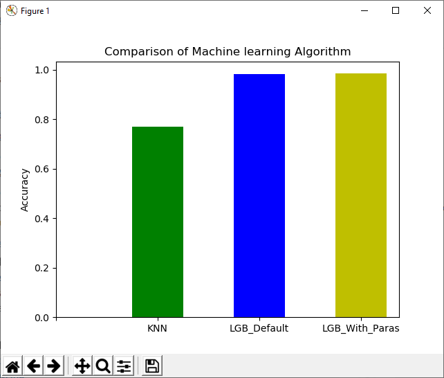
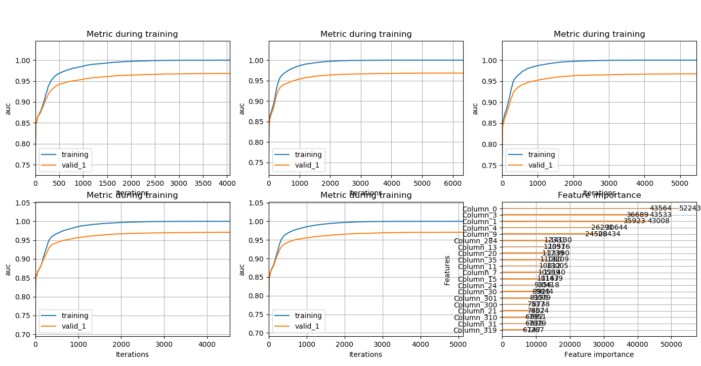

# Transication Fraud Detect (dirty/extrely imbalanced dataset)

## Resources
Dataset

(example dataset contains 1000 records only)

[Transiction-Dataset](./figures/transication.csv)  

[ID-Dataset](./figures/id.csv)  

### Team member:
|     Name    |
|:------------|
|Jun Liu    |
|Wu Yifan     |
|Marco        |
|Saidath      |

Date: 2020.02.01 ~ 2020.03.01
-----
## Introduction 
The financial services industry and the industries that involve financial transactions are suffering from fraud-related losses and damages. Using machine learning (ML) approach to fraud detection has many advantages, such as real-time processing, automatic detection of possible fraud scenarios, and could find hidden and implicit correlations in dataset. The dataset we used in this project are very dirty and imbalance, dataset preproce and feature engineering occupied most of the time, we use lightDBM machine learning model, after doing dataset preprocessing. feature engineering, training and validation, we could reach AUC score 0.96.
### Main finding
The problem we need to solve is to classify transactions. The goal is to determine a fraud transaction.  The target variables:  isFraud (TRUE, FALSE), the type of learning is  supervised learning, it is a classification problem. 
We use lightDBM machine learning algorithm. Since our dataset is highly imbalanced and with many missing values(NaN), we spent 90% of time to do the dataset preprocessing and feature engineering. 10% of time to select algorithm and parameters.  

### Other finding
Some features were more complexed to handle because they had hidden values making it impossible to determine what exactly they were.

### System Pipline

#### Prediction Algorithm 

The lightGBM python library was used in order to produce models for the prediction of the attribute Is_Fraud (Binary variable either TRUE or FALSE). Following the preprocessing and the feature engineering task, as dataset was fed to this algorithm along with the following parameters, which are explained below:  

Since the predicted value is a binary variable, the following estimator was selected (i.e. LGBMClassifier): 

model = lgb.LGBMClassifier(**params)

Following the selection of the specific estimator, the following parameters were passed to it: 

LGB_PARAM = params = {
    'boosting_type': 'gbdt',
    'objective': 'binary',
    'learning_rate': 0.02,
    'feature_fraction': 0.9,
    'bagging_fraction': 0.7,
    'scale_pos_weight': 0.04,
    'bagging_freq': 10,
    'verbose': -1,
    'silent':-1,
    "max_depth": 10,
    "num_leaves": 128,
    "max_bin": 512,
    "n_estimators": 100000,
    'metric': 'auc',
    'random_state': seed,
    'nthread': 4
} 

The boosting type selected was the Gradient Boosting Decision TREE (gbdt), which is also the default value.
The objective selected was binary as this is a binary classification application
The learning rate selected was 2% (0.02). Default is (0.01) which as discussed in class could lead to overfitting; based on instructors experience a 2% learning rate was proposed. 
During our testing of the algorithm to generate the models, we team played with the feature_fraction and bagging_fraction parameter. They were quite useful as the could speed up training and deal with overfitting. The selected values were proposed during class.
Verbose was used during in class to better understand the logic behind the training of the model and identify the exact Epoch were the error was minimized for the evaluation of the test data.
max_depth limits the max depth of the tree model. The default is 20, a value of 10 was recommended to avoid overfitting
max_bin parameter which is the max number of bins that feature values are be bucketed in was set to 512, the default value is 255. At 512 the accuracy of the training is reduced but may improve the overall power and avoid over-fitting.
The metric used for the performance evaluation was AUC (area under curve). This allows us to generate these metrics in the model so that they could easily be visualized with the built-in plot function provided by the library.

#### Methodologies:
Train/test/valid split
Use Cross-Validation to allow us to utilize our data better. 
Simple K-Folds — We split our data into K parts, let’s use K= 5 for example, then we will have 5 models. Use the means value of all 5 output to predict for new input.

-----
## Data Preprocessing 

- This part bascially we need handle the NAN values in our dataset 

- Transfer 'object' values into digital data

- Reduce Memory

-----

## Handle NAN Value

- NAN Value has crucial part in data preprocessing. what we did is fill in the float and integer columns with their median, fill in 'unknow' into the 'object' columns.

- Since if we fill in average values may has a chance to get very unbalanced dataset,therefore median values should be more Suitable

- Here is the code we use:

-----

## Reduce Memory and Transfer values

- Since computer can only read the digital values that we have to transfer all the 'object' values into the digital values.

- Memory Reduce can help us save the time when we run our model, it can improve our effiency of work. Here, Integers and Floats values were converted into smaller number types to reduce their overall memory usage.

-----

## Feature Engineering 

- This part we are going to explain the Feature Engineering that we did for our project and the purpose of doing it.
  
Bascially there are 4 big part for the whole feature engineering that we are going to explain.
  
-----

### ['P_emaildomain'] Feature 
- Handle the Nonsense value and transfer them in some value in order to make the computer read it:

- The red circle is the one that we need to take care of:

- Therefore we would like to replace those value then when we will get less pressure when we train our model.

- Also we create a new feature called ['Region_emaildomain']:

- What we did is transfer all the information that we got in ['P_emaildomain'] and then to get all the exact country where those email were sent. We think the location of those email is going to help our model a lot since each country must have their characteristics. Here is the code below: 

-----

## ['TransactionAmt'] Feature

- This feature basically has lots of outlier that we need to handle since we displot it out and find out this one is long_tail type: 

- we think that if this feature has too many outliers it might make our model unsteady, therefore we decide to drop the outlier values in this feature. 

- Here is the code that we use:

- we decide to drop the value which is greater than the 99 percent of the values also the values which is less than 1 percent. Here is the Figure after drop: 

-----

## ['TransactionDT'] Feature

- This feature contains all the transaction date time which is an object type in the oringal dataframe. Therefore we think we need to transfer them to the dateobject in order to let our computer read it and run.

- More specificaly we need to add some columns like: 'df['day']', ' df['year']' etc, which are some important features that are gotten from the ['TransactionDT'].

- Here is the code that we use:

-----

### ['Card1'], ['Card2'] Features

- .There are some importance features such as ['Card1'], ['Card2'] that has huge amounts of values which is really complex to use. We think these features need to be handled into the category type value. 

- Category type values are going to relase some pressure when we are going to train our model. Therefore we find those features and set up some bins(threshold). In this way, the data is more clean and orangized. 

- Also, we think only some important features need to be handled in category type since they can affect the model a lot.

- Here is the code that we use:

### Feature Aggregation
- Some features were concatenated to create new ones in order to improve the model and it's precision. These features were then merged to our main data table. 

- A ['User_id'] column was created containing some information from ['emaildomain'], ['card1'], ['addr1 & 2']. Then later, grouped by with respect to some aggregated statistics from ['TransactionAmt'].

- We formatted and extracted some data from ['TransactionDT'], the date and time column. New features such as the year, month, day, hour and minute at which the transaction occured were obtained and added.

## Final Score

## References
[LightGBM](https://lightgbm.readthedocs.io/en/latest/index.html) 
[Scikit-kearn Classifier comparison](https://scikit-learn.org/stable/auto_examples/classification/plot_classifier_comparison.html)   
[Matplotlib3.1.1](https://matplotlib.org/3.1.1/users/whats_new.html)  
[Principal component analysis (PCA)](https://scikit-learn.org/stable/modules/generated/sklearn.decomposition.PCA.html)
[pandas](https://pandas.pydata.org/docs/)
[Seaborn](https://seaborn.pydata.org/)
